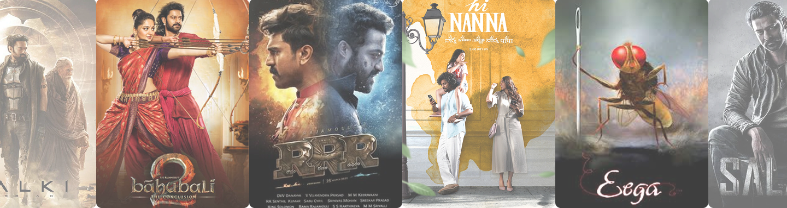

# 🎬 TFI Movie App

<div align="center">
  
  
  [](https://tfi-movie-app.vercel.app/)
  [](https://reactjs.org/)
  [](https://vitejs.dev/)
  [](https://tailwindcss.com/)
  [](LICENSE)
</div>

## 📋 Table of Contents

- [About](#about)
- [Features](#features)
- [Tech Stack](#tech-stack)
- [Getting Started](#getting-started)
- [Environment Variables](#environment-variables)
- [API Integration](#api-integration)
- [Project Structure](#project-structure)
- [Screenshots](#screenshots)
- [Deployment](#deployment)
- [Contributing](#contributing)
- [License](#license)

## 🎯 About

**TFI Movie App** is a modern, responsive web application dedicated to Telugu Film Industry (TFI) movies. Built with React and powered by The Movie Database (TMDB) API, it provides users with an intuitive interface to discover, search, and explore Telugu cinema.

### 🌟 Key Highlights

- **TFI-Focused**: Specialized for Telugu movie enthusiasts
- **Real-time Search**: Dynamic search with intelligent filtering
- **Trending Movies**: Curated trending movies with search analytics
- **Responsive Design**: Seamless experience across all devices
- **Modern UI/UX**: Beautiful glassmorphism design with smooth animations

## ✨ Features

### 🔍 **Smart Search**
- Real-time movie search with debouncing
- Intelligent filtering for Telugu movies
- Search results sorted by ratings and popularity
- Empty state handling with user-friendly messages

### 📈 **Trending Movies**
- Dynamic trending movies section
- Search analytics tracking with Appwrite database
- Most searched movies display
- Visual ranking system

### 🎨 **Modern Design**
- Glassmorphism UI components
- Smooth Lottie animations for loading states
- Responsive grid layout
- Custom scrollbars and hover effects
- Gradient text effects and shadow styling

### 🚀 **Performance**
- Optimized API calls with error handling
- Lazy loading for images
- Efficient state management
- Fast build times with Vite

## 🛠 Tech Stack

### **Frontend**
- **React 19.1.0** - UI library with latest features
- **Vite 7.0.0** - Next-generation frontend tooling
- **TailwindCSS 4.1.11** - Utility-first CSS framework
- **Lottie React** - Smooth animations

### **Backend Services**
- **TMDB API** - Movie database and information
- **Appwrite** - Backend-as-a-Service for analytics

### **Development Tools**
- **ESLint** - Code linting and formatting
- **PostCSS** - CSS processing
- **Vercel** - Deployment and hosting

## 🚀 Getting Started

### Prerequisites

- Node.js 18+ and npm
- TMDB API key
- Appwrite account (optional, for trending features)

### Installation

1. **Clone the repository**
   ```bash
   git clone https://github.com/BHARGAVC27/Movie-App.git
   cd Movie-App/client
   ```

2. **Install dependencies**
   ```bash
   npm install
   ```

3. **Set up environment variables**
   ```bash
   cp .env.example .env
   ```
   
4. **Start the development server**
   ```bash
   npm run dev
   ```

5. **Open your browser**
   ```
   http://localhost:5173
   ```

## 🔐 Environment Variables

Create a `.env` file in the `client` directory:

```env
# TMDB API Configuration (Required)
VITE_TMDB_API_KEY=your_tmdb_api_key_here

# Appwrite Configuration (Optional - for trending features)
VITE_APPWRITE_PROJECT_ID=your_appwrite_project_id
VITE_APPWRITE_DATABASE_ID=your_database_id
VITE_APPWRITE_COLLECTION_ID=your_collection_id
```

### Getting API Keys

1. **TMDB API Key**:
   - Visit [TMDB website](https://www.themoviedb.org/)
   - Create an account and request an API key
   - Add the API key to your `.env` file

2. **Appwrite Setup** (Optional):
   - Create account at [Appwrite](https://appwrite.io/)
   - Create a new project
   - Set up database and collection for trending movies
   - Add credentials to `.env` file

## 🔌 API Integration

### TMDB API Endpoints

- **Popular Movies**: `/discover/movie` - Telugu movies sorted by popularity
- **Search Movies**: `/search/movie` - Search with Telugu language filtering
- **Movie Details**: Comprehensive movie information including ratings, release dates, and overviews

### Search Algorithm

```javascript
// Intelligent Telugu movie filtering
const filteredMovies = data.results
  .filter(movie => {
    return (
      movie.original_language === "te" ||
      movie.title?.toLowerCase().includes("telugu") ||
      movie.overview?.toLowerCase().includes("telugu")
    );
  })
  .sort((a, b) => {
    // Multi-criteria sorting: rating → popularity → vote count
    const ratingDiff = (b.vote_average || 0) - (a.vote_average || 0);
    if (Math.abs(ratingDiff) > 0.5) return ratingDiff;
    
    const popularityDiff = (b.popularity || 0) - (a.popularity || 0);
    if (Math.abs(popularityDiff) > 10) return popularityDiff;
    
    return (b.vote_count || 0) - (a.vote_count || 0);
  });
```

## 📁 Project Structure

```
client/
├── public/
│   ├── hero.png              # Hero section image
│   ├── No-Poster.png         # Fallback poster image
│   ├── search.svg            # Search icon
│   ├── Rating.svg            # Rating star icon
│   └── images/               # Movie poster images
├── src/
│   ├── App.jsx               # Main application component
│   ├── App.css               # Global styles
│   ├── index.css             # TailwindCSS configuration
│   ├── main.jsx              # Application entry point
│   ├── Search.jsx            # Search input component
│   ├── MovieCard.jsx         # Movie display component
│   ├── appwrite.js           # Appwrite database functions
│   ├── loading.json          # Lottie animation data
│   └── assets/               # Static assets
├── .env                      # Environment variables
├── .gitignore               # Git ignore rules
├── package.json             # Dependencies and scripts
├── tailwind.config.js       # TailwindCSS configuration
├── vite.config.js           # Vite configuration
└── README.md                # Project documentation
```

## 🎨 Screenshots

<div align="center">

### 🏠 Homepage with Hero Section


### 🔍 Search Interface
*Dynamic search with real-time results*

### 📱 Responsive Design
*Seamless experience across all devices*

### 🎬 Movie Cards
*Beautiful movie cards with ratings and details*

</div>

## 🚀 Deployment

### Vercel Deployment (Recommended)

1. **Connect to Vercel**:
   ```bash
   npm install -g vercel
   vercel
   ```

2. **Set environment variables in Vercel dashboard**:
   - `VITE_TMDB_API_KEY`
   - `VITE_APPWRITE_PROJECT_ID`
   - `VITE_APPWRITE_DATABASE_ID`
   - `VITE_APPWRITE_COLLECTION_ID`

3. **Deploy**:
   ```bash
   vercel --prod
   ```

### Alternative Deployment Options

- **Netlify**: Drag and drop build folder
- **GitHub Pages**: Using GitHub Actions
- **Railway**: Connect GitHub repository

## 🏗 Scripts

```bash
# Development
npm run dev          # Start development server

# Building
npm run build        # Build for production
npm run preview      # Preview production build

# Code Quality
npm run lint         # Run ESLint
```

## 🤝 Contributing

We welcome contributions! Please follow these steps:

1. **Fork the repository**
2. **Create a feature branch**:
   ```bash
   git checkout -b feature/amazing-feature
   ```
3. **Commit your changes**:
   ```bash
   git commit -m 'Add some amazing feature'
   ```
4. **Push to the branch**:
   ```bash
   git push origin feature/amazing-feature
   ```
5. **Open a Pull Request**

### Development Guidelines

- Follow the existing code style
- Add comments for complex functionality
- Test your changes thoroughly
- Update documentation as needed


## 🔮 Future Enhancements

- [ ] Movie trailers integration
- [ ] User reviews and ratings
- [ ] Watchlist functionality
- [ ] Advanced filtering options
- [ ] Movie recommendations
- [ ] Dark/Light theme toggle
- [ ] PWA support


## 👨‍💻 Author

**BHARGAV C** - [GitHub](https://github.com/BHARGAVC27)

## 🙏 Acknowledgments

- [The Movie Database (TMDB)](https://www.themoviedb.org/) for providing the movie API
- [Appwrite](https://appwrite.io/) for backend services
- [Vercel](https://vercel.com/) for hosting
- [React](https://reactjs.org/) team for the amazing framework
- Telugu Film Industry for inspiring this project

---

<div align="center">
  <p>⭐ Star this repository if you found it helpful!</p>
  <p>🍿 Happy movie browsing! 🎬</p>
</div>
